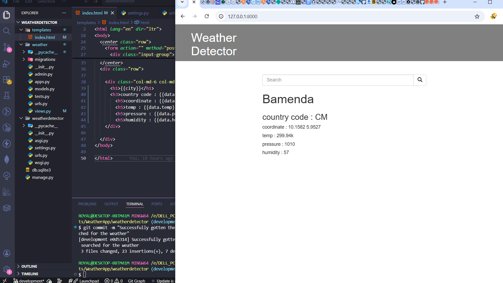
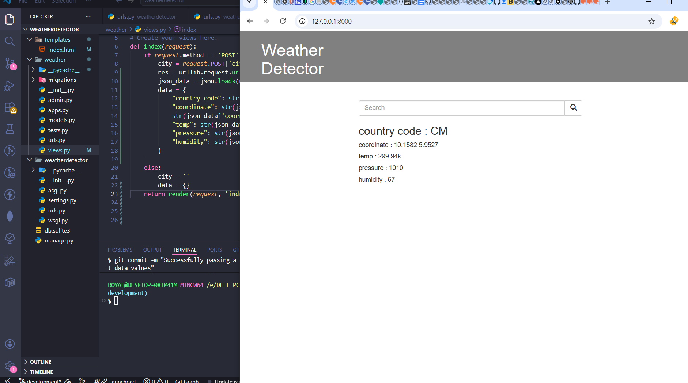
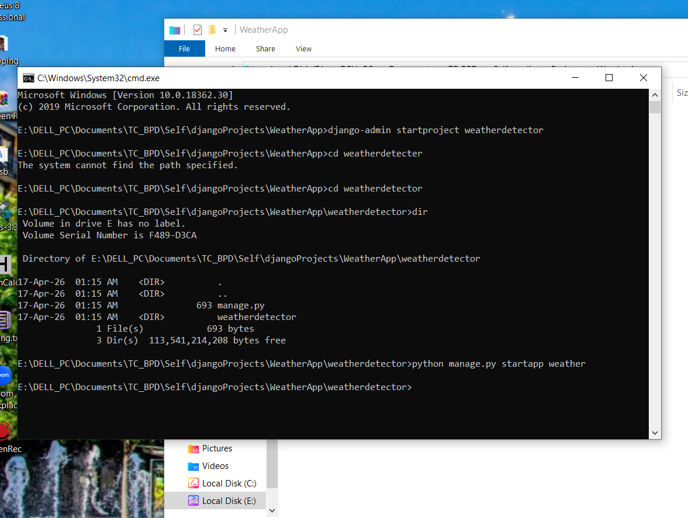
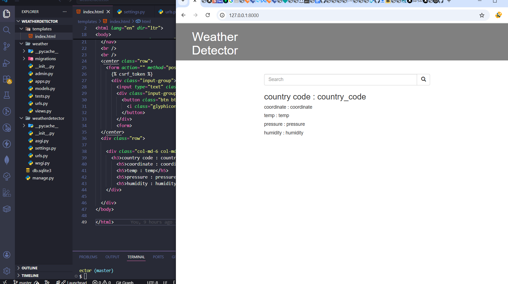

# Django Weather Detector Application

A simple weather web application that fetches real-time weather data from OpenWeatherMap API. Users can search for any city and get the country, temperature, and humidity information.


##  Screenshots

| Homepage Search Result | Development Process |
|---------------|-------------|
|  |  |

| Installations | Initial Html Page View |
|-------------|----------------|
|  |  |

*To see other screenshots, visite the `/screenshots` folder*


## Project Overview

This is a weather application I built after learning Django. It uses a free API from OpenWeatherMap to get live weather data. The design is minimal - black and white, just the essentials. Type a city name, click search, and see the country, temperature, and humidity.

**What this project does:**
- Accepts city name from user input
- Fetches weather data from OpenWeatherMap API
- Displays country code, temperature (in Kelvin/Celsius), and humidity
- Shows error message if city is not found

## Features

- Search weather by city name
- Display country code (e.g., US, GB, NG)
- Show temperature in Kelvin (or converted to Celsius)
- Show humidity percentage
- Clean black and white interface
- Responsive design

## Tech Stack

- Django 6.0.3
- OpenWeatherMap API
- HTML5
- CSS3 (minimal)
- SQLite (no database tables needed for this app)

## Project Structure
weather-app/
├── screenshots/ # Application screenshots
├── weatherDetector/ # Project settings folder
│ ├── settings.py # Django settings
│ ├── urls.py # Main URL routing
│ └── wsgi.py
├── Weather/ # Main application folder
│ ├── models.py # Database models (empty for this project)
│ ├── views.py # API call and weather logic
│ ├── urls.py # App URL routing
│ ├── admin.py
│ └── templates/ # HTML templates
│  |── index.html # Main search page
├── manage.py
└── README.md

##  Installation & Setup + Contribution

### Prerequisites
- Python 3.13+ installed

### Step 1: Clone the Repository
```bash
git clone https://github.com/TIZIHMARKP/django-weather-detectorApp.git
cd django-blog-app
```
### Step 2: Create Virtual Environment

# Windows
python -m venv venv
venv\Scripts\activate

# Mac/Linux
python3 -m venv venv
source venv/bin/activate

### Step 3: Start the project and contribute
- Contribute to the project by creating a new branch, push your contribution to it and open a Pull Request / Merge Request

## How It Works
### API Request Flow

- User enters city name in search form

- Django sends request to OpenWeatherMap API

- API returns JSON weather data

- Django extracts country, temperature, and humidity

- Information displays on the same page

## What I Learned
- Working with external REST APIs

- Handling API responses (JSON)

- Making HTTP requests using Python

- GET vs POST methods in forms

- CSRF token protection

- Error handling for API failures

## Future Improvements
- Add option to switch between Kelvin/Celsius/Fahrenheit

- Display weather icons

- Show wind speed and pressure

- Save recent searches

- Auto-detect user's location

## License
This project is open source and available for learning purposes.

 after completing my Django course.
Questions? Open an issue on GitHub.

<div align="center"> <strong>⭐ Built with Django and OpenWeatherMap API ⭐</strong> <br/> <sub>Please give this project a STAR</sub> <br/> <sub> Questions? Open an issue on GitHub</sub> <br /> April 2026 </div> 
